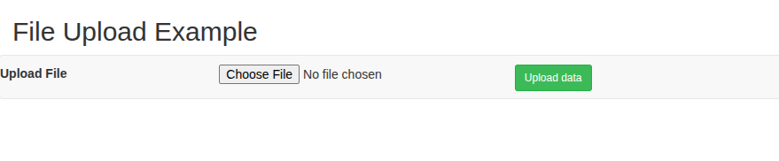
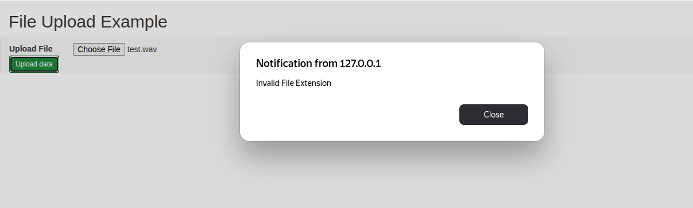

### Копирование выбранного файла из браузера в папку на сервере.

__Themleaf + Bootstrap.__ 

Использована java 11.

````java
export JAVA_HOME=/usr/lib/jvm/java-1.11.0-openjdk-amd64
mvn -N wrapper:wrapper -Dmaven=3.6.3
````

Запуск:
````shell
./run.sh
````

При сбоях перекомпилировать проект командой:

````shell
./mvnw clean package
````

Открыть браузер по адресу [http://127.0.0.1:8080/upload](http://127.0.0.1:8080/upload).



### Ключевые моменты по загрузке файла в Homepage.html и UploadController.java.

Homepage.html. Важное тут:

1. POST 
2. action="/upload"
3. enctype="multipart/form-data"
4. <input type="file" ... />) //  type="file"
5. Ну и <input type="submit"...

````html
			<div class="col-md-6">
				<form method="POST" action="/upload"
					onsubmit="return Validate(this);" enctype="multipart/form-data">
					<div class="col-sm-6">
						<input type="file" name="file"  />
					</div>
					<div class="col-sm-6">
						<input type="submit" class="btn btn-success btn-sm" value="Upload data" />
					</div>
				</form>
			</div>

````

UploadController.java (внимание на __POST__, __@MultipartFile__):

````java
	@PostMapping("/upload")
	public String singleFileUpload(@RequestParam("file") MultipartFile file, RedirectAttributes redirectAttributes) {
		log.info("POST /upload");

		if (file.isEmpty()) {
			redirectAttributes.addFlashAttribute("message", "Please select a file to upload");
			return "redirect:uploadStatus";
		}
		String UploadedFolderLocation = UPLOAD_FILE_LOCATION+"/";
		String fileName = null;
//			this is done to work on IE as well
		String pattern = Pattern.quote(System.getProperty("file.separator"));
		String[] str = file.getOriginalFilename().split(pattern);
		if (str.length > 0)
			fileName = str[str.length - 1];
		else
			fileName = str[0];
		log.info("FileName : " + fileName);
		if(!storageService.store(file, fileName,UPLOAD_FILE_LOCATION))
		{
			redirectAttributes.addFlashAttribute("message", "Error occurred while uploading the file");
			redirectAttributes.addFlashAttribute("status", "false");
			return "redirect:/uploadStatus";
		}
		redirectAttributes.addFlashAttribute("message", "You successfully uploaded '" + fileName + "'");
		redirectAttributes.addFlashAttribute("status", "true");
		return "redirect:/uploadStatus";
	}

````

Проверяется расширение. Если не csv или zip, то выдается ошибка. 



Проверка выполняется в Homepage.html в function Validate(oForm) следующим образом:

````html
<form method="POST" action="/upload"
					onsubmit="return Validate(this);" enctype="multipart/form-data">
````
 Если Validate вернет true, то форма отправляется на сервер через метод POST на url "/upload" (внимание на "enctype="multipart/form-data").
 Файл цепляется в <input type="file" name="file"  />, переменная для файла называется "file" (name="file").
 
Cохранение происходит в StorageService.store(MultipartFile file, String catalog, String fileName).

Использован bootstrap. __Не переделывать!__